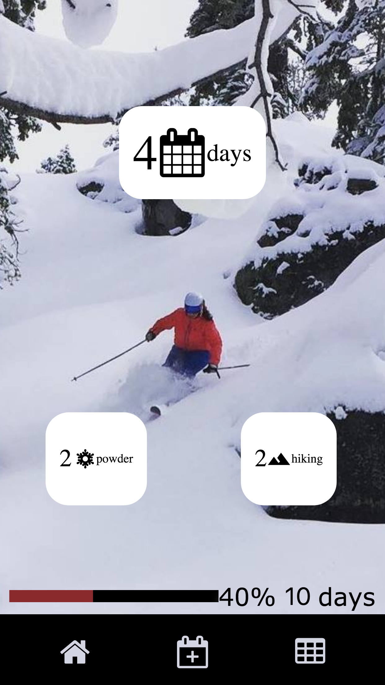
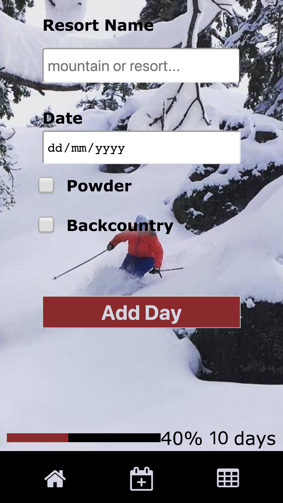
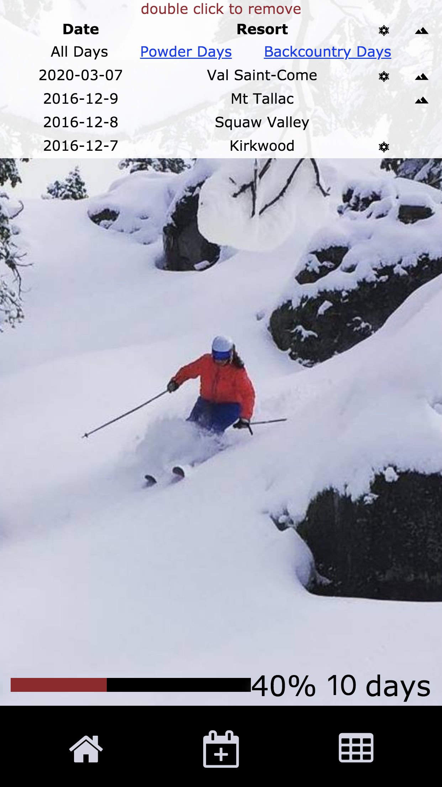

# Ski Day Counter
Ski Day Counter app exercise built with React, Express and Redux.

## To Start Exercise
- Clone repository
- Install dependencies `npm install`
- Run Express server `npm run suggestions`
- Start with `npm start`
- Visit `http://localhost:3000`
- Open your editor and break things ;-)

## Requirements
- Basic understanding of Functional Programming
- Basic knowledge of ECMAScript 6
- Basic knowledge of [React.js](https://reactjs.org/), [Express.js](https://expressjs.com/) and [Flux Architecture](https://facebook.github.io/flux/)

## Thoughts & Credits
I had a lot of fun while building this app within the context of [Alex Bank](https://www.linkedin.com/learning/instructors/alex-banks)'s class [here](https://www.linkedin.com/learning-login/share?forceAccount=false&redirect=https%3A%2F%2Fwww.linkedin.com%2Flearning%2Flearning-redux%3Ftrk%3Dshare_ent_url). 
A great starting point to explore and become fluent with the React & Redux ecosystem.